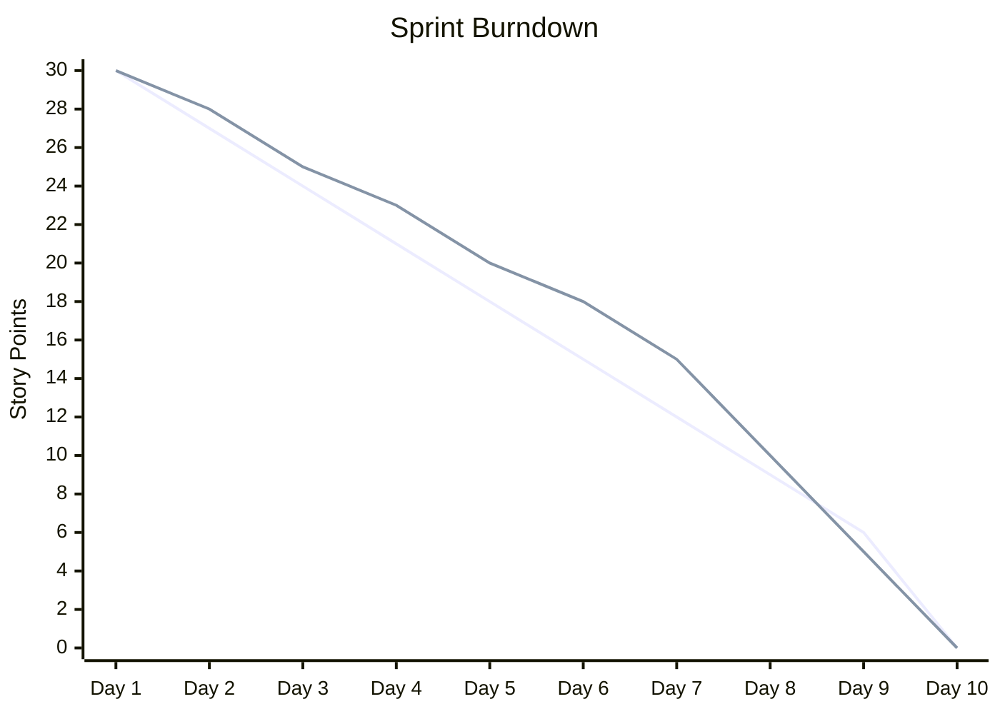

Burndown and burnup charts are visual tools that show the progress of work during a sprint or release. They help teams track their velocity and predict whether they'll complete their planned work.

## Burndown Chart

A burndown chart shows **remaining work** over time. It "burns down" from the total work to zero as the team completes items.

### What it shows
- **X-axis**: Time (days of the sprint)
- **Y-axis**: Remaining work (story points or hours)
- **Ideal line**: Straight line from start to finish
- **Actual line**: Real progress, which fluctuates

### Reading a burndown chart

- **Above the ideal line**: Behind schedule
- **Below the ideal line**: Ahead of schedule
- **Flat line**: Work is blocked or no progress
- **Spike upward**: Scope was added to the sprint

### Common burndown patterns

| Pattern | What it means | What to do |
|---------|--------------|------------|
| Consistently above ideal | Team is behind | Reassess scope or capacity |
| Consistently below ideal | Team is ahead | Consider adding more work |
| Flat line | Work is blocked | Identify and remove blockers |
| Spike up | Scope creep | Push new items to next sprint |
| Late drop | Procrastination or estimation issues | Improve estimation accuracy |

## Burnup Chart

A burnup chart shows **completed work** over time. It "burns up" from zero to the total.

### What it shows
- **X-axis**: Time
- **Y-axis**: Work completed (story points)
- **Scope line**: Total planned work (can change)
- **Progress line**: Work completed so far

### Burnup vs Burndown

| Aspect | Burndown | Burnup |
|--------|----------|--------|
| **Shows** | Remaining work | Completed work |
| **Scope changes** | Harder to see | Clearly visible |
| **Progress** | Burns down | Burns up |
| **Simplicity** | Simpler | More information |

### Why burnup is sometimes better
- **Scope changes are visible** — The scope line can move up
- **Progress is always positive** — You can see what's been done
- **Easier to explain** — "We've done X out of Y" is intuitive

## How to Use These Charts

### During the sprint
- **Update daily** — Keep the chart current
- **Review in standup** — Discuss progress and blockers
- **Spot trends early** — Don't wait until day 8 to see you're behind

### For planning
- **Track velocity** — Use past burndowns to estimate future sprints
- **Identify patterns** — Does the team always struggle with certain types of work?
- **Improve estimation** — Compare estimated vs actual

### For retrospectives
- **Discuss the shape** — What does the chart tell us about our process?
- **Identify improvements** — What caused flat lines or spikes?
- **Celebrate wins** — Acknowledge when the chart looks good

## Tools for Burndown/Burnup Charts

- **Jira** — Built-in sprint reports
- **Azure DevOps** — Sprint burndown widgets
- **GitHub Projects** — Project boards with charts
- **Linear** — Sprint insights
- **Manual** — Whiteboard or spreadsheet

## Burndown/Burnup and Agile Practices

- **[[Sprint Goal]]** — Charts show progress toward the goal
- **[[Velocity]]** — Charts visualize velocity in action
- **[[Sprint Backlog]]** — Charts track the sprint backlog
- **[[Daily Scrum]]** — Charts are discussed in standups
- **[[Retrospectives]]** — Charts inform retrospective discussions
- **[[Sprint Planning]]** — Historical charts inform planning
