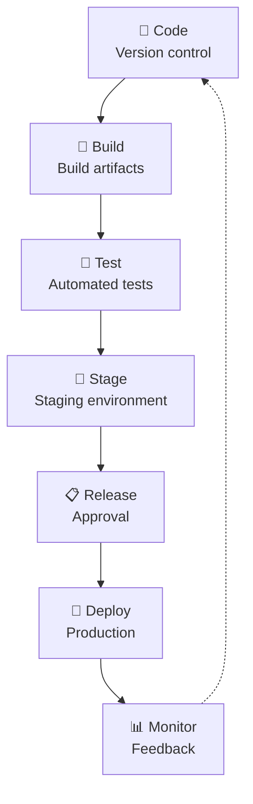

Continuous Delivery (CD) is the ability to get changes into production **quickly, safely, and sustainably**. It extends [[Continuous Integration]] by automating the release process so that any passing build can be deployed to production at any time.

## What is Continuous Delivery?

The core principle: **Every change should be deployable to production.**

This means:
- The mainline is always in a releasable state
- Automated tests verify quality at every step
- Deployment is a routine, low-risk activity
- Releases happen frequently and predictably

## The Continuous Delivery Pipeline



### Key stages

1. **Commit** — Developer commits code
2. **Build** — Automated build creates artifacts
3. **Test** — Automated tests verify quality
4. **Stage** — Deploy to staging environment
5. **Release** — Get approval for production
6. **Deploy** — Deploy to production
7. **Monitor** — Verify in production

## Continuous Delivery vs Continuous Deployment

| Practice | What it means |
|----------|--------------|
| **Continuous Integration** | Integrate and test code changes frequently |
| **Continuous Delivery** | Automatically prepare releases for deployment |
| **Continuous Deployment** | Automatically deploy every change to production |

All three build on each other:
```
CI → CD → CD
Integration → Delivery → Deployment
```

## Benefits of Continuous Delivery

### Faster time to market
- **Smaller releases** are easier to deploy
- **Faster feedback** from customers
- **Reduced lead time** from idea to production

### Higher quality
- **Automated testing** catches issues early
- **Consistent processes** reduce human error
- **Rollback capabilities** reduce risk

### Lower risk
- **Small changes** are easier to understand and debug
- **Frequent releases** reduce the "big bang" risk
- **Automated processes** reduce manual mistakes

### Better developer experience
- **Less stress** — deployment is routine
- **More confidence** — tests verify quality
- **Faster feedback** — know immediately if something breaks

## Continuous Delivery Practices

### 1. Build automation
- Automate the entire build process
- Create reproducible builds
- Version all artifacts
- Store artifacts in a repository

### 2. Automated testing
- **Unit tests** — Fast, isolated tests
- **Integration tests** — Verify component interactions
- **Acceptance tests** — Verify business requirements
- **Performance tests** — Verify scalability

### 3. Version control everything
- Application code
- Infrastructure code
- Configuration
- Database schemas
- Test scripts

### 4. Environment management
- Environments as code
- Infrastructure as Code (IaC)
- Containerization (Docker)
- Orchestration (Kubernetes)

### 5. Deployment automation
- One-click deployments
- Zero-downtime deployments
- Automatic rollbacks
- Feature flags

### 6. Monitoring and feedback
- Application monitoring
- Infrastructure monitoring
- Log aggregation
- Alerting

## Continuous Delivery and Agile

CD is a natural extension of agile principles:

- **Agile Manifesto** — "Working software is the primary measure of progress"
- **[[Sprint Planning]]** — Plan for frequent releases
- **[[Sprint Review]]** — Demo production-ready software
- **[[Retrospectives]]** — Improve the delivery pipeline
- **[[Technical Debt]]** — Automate to reduce manual work

## Continuous Delivery and XP Practices

- **[[Continuous Integration]]** — Foundation of CD
- **[[Test-Driven Development]]** — Ensures quality at every step
- **[[Pair Programming]]** — Reviews changes before they're built
- **[[Refactoring]]** — Keeps code maintainable for automation
- **Small Releases** — Frequent, small releases are safer
