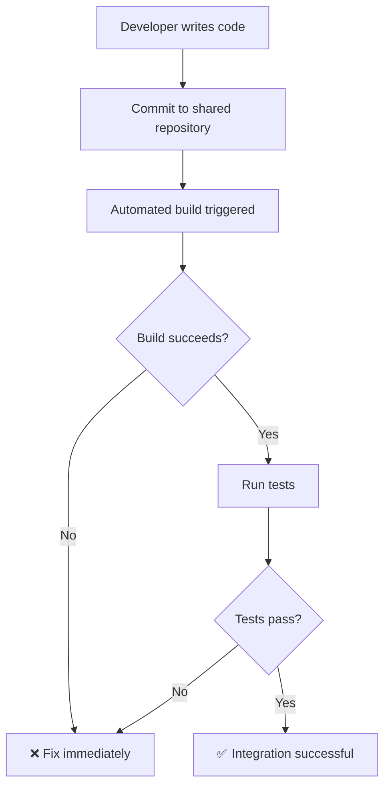
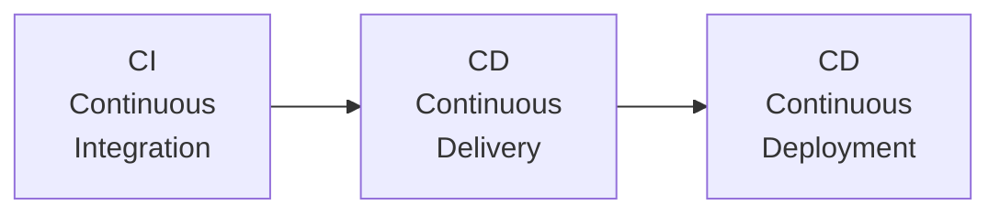

Continuous Integration (CI) is a [[Extreme Programming|XP]] practice where developers integrate their code changes into a shared repository multiple times per day. Each integration is verified by an automated build and test suite to detect integration errors as quickly as possible.

## What is Continuous Integration?

The core idea is simple: **integrate and test code changes frequently** rather than waiting until the end of a sprint or release.

### The CI Workflow

### Key Principles

1. **Maintain a single source repository** — Everyone commits to the same mainline
2. **Automate the build** — Building and testing should be one command
3. **Make the build self-testing** — Include tests in the automated build
4. **Every commit builds on main** — No long-lived feature branches
5. **Fix broken builds immediately** — A broken build is the team's #1 priority
6. **Keep the build fast** — Aim for under 10 minutes
7. **Test in a clone of the production environment** — Catch environment-specific issues
8. **Make it easy to get the latest deliverables** — Artifacts should be easily accessible
9. **Everyone can see what's happening** — Build status visible to all

## Benefits of CI

### Faster feedback
- **Know within minutes** if your changes broke something
- **Immediate feedback** on code quality and test results
- **No integration hell** — problems are caught when they're small and easy to fix

### Reduced risk
- **Small, frequent changes** are easier to understand and debug
- **Always have a working codebase** — you can release at any time
- **Confidence to refactor** — tests catch regressions immediately

### Better code quality
- **Automated testing** catches bugs before they reach production
- **Code review** happens through the build process
- **Consistent quality** enforced by automated checks

### Improved collaboration
- **No integration conflicts** — everyone works on the same codebase
- **Visible progress** — team sees what everyone is working on
- **Shared responsibility** for code quality

## CI Best Practices

### 1. Commit to mainline at least daily
The more frequently you commit, the smaller each change is, and the easier it is to find and fix problems.

### 2. Fix broken builds immediately
A broken build should be treated as the team's **highest priority**. If the build is broken, stop what you're doing and fix it.

### 3. Keep builds fast
A slow build discourages frequent integration. Aim for:
- **Under 5 minutes** for the core build
- **Under 30 minutes** for the full test suite
- Use parallel testing and build caching

### 4. Test in a clean environment
Every build should start from a clean state to ensure reproducibility:
- Use containers (Docker)
- Use fresh databases
- Clean up test data

### 5. Automate everything
- **Build** — compile, package, deploy
- **Test** — unit, integration, acceptance
- **Quality** — linting, code analysis, security scanning
- **Deploy** — staging, production

### 6. Make build results visible
- Display build status on team dashboards
- Notify the team of failures immediately
- Celebrate successful builds

## CI Tools

### Build and CI Servers
- **GitHub Actions** — Integrated with GitHub repositories
- **GitLab CI/CD** — Built into GitLab
- **Jenkins** — The most popular open-source CI server
- **CircleCI** — Cloud-based CI/CD
- **Travis CI** — Cloud-based, popular for open source

### Build Tools
- **Maven/Gradle** — Java
- **npm/yarn** — JavaScript
- **pip/poetry** — Python
- **Cargo** — Rust
- **Make** — General

## CI vs Continuous Delivery vs Continuous Deployment

| Practice | What it means |
|----------|--------------|
| **Continuous Integration** | Integrate and test code changes frequently |
| **Continuous Delivery** | Automatically prepare releases for deployment |
| **Continuous Deployment** | Automatically deploy every change to production |

All three build on each other:

## Common CI Mistakes

1. **Not fixing broken builds** — A broken build should stop everything
2. **Slow builds** — If builds take too long, people won't run them
3. **Flaky tests** — Unreliable tests erode trust in the CI system
4. **Not enough tests** — CI without tests is just continuous compilation
5. **Skipping the build locally** — Always run the build before committing
6. **Ignoring build failures** — "It works on my machine" is not acceptable

## CI and [[Test-Driven Development]]

CI and [[Test-Driven Development|TDD]] work together perfectly:
- TDD ensures you have a comprehensive test suite
- CI runs those tests on every commit
- Together they provide **continuous confidence** in code quality
- Refactoring is safe because tests catch regressions

## CI and [[Pair Programming]]

CI supports [[Pair Programming|pair programming]] by:
- Ensuring all code is tested before integration
- Providing a safety net for shared code changes
- Making pair rotations smoother (less merge conflict risk)
- Automating quality checks that pairs might miss
