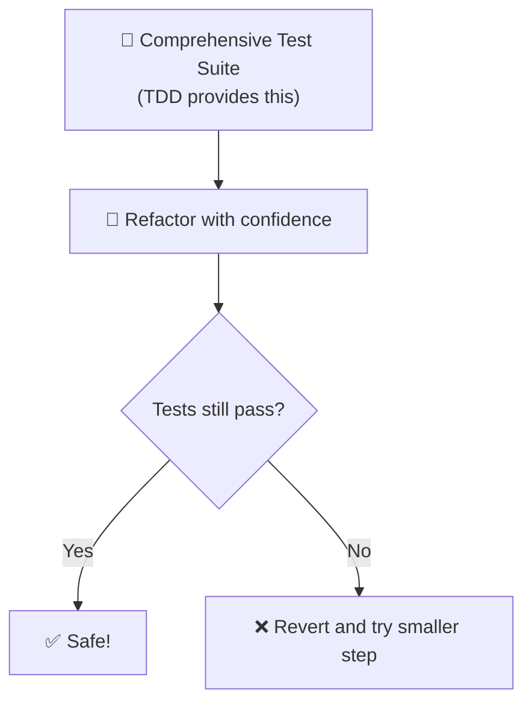

Refactoring is the process of improving the internal structure of code without changing its external behavior. It's a core [[Extreme Programming|XP]] practice that keeps code clean, maintainable, and adaptable to change.

> "Refactoring is a controlled process for improving the design of an existing code base."
> — Martin Fowler

## Why Refactor?

### Reduce technical debt
Code naturally degrades over time as new features are added and quick fixes accumulate. Refactoring pays down this debt by:
- Removing duplicated code
- Simplifying complex logic
- Improving naming and clarity
- Breaking apart large components

### Improve readability
Clean code is easier to understand:
- Smaller, focused functions
- Descriptive variable and method names
- Clear code structure
- Less cognitive load for developers

### Enable change
Well-structured code is easier to modify:
- Adding new features is simpler
- Bugs are easier to find and fix
- Testing is easier
- Risk of breaking things is lower

### Support learning
Refactoring helps you understand the codebase:
- Exploring how code works
- Identifying design flaws
- Discovering hidden dependencies
- Learning the domain

## When to Refactor

### The Rule of Three
When you find yourself copying code for the third time, refactor it into a shared abstraction.

### Boy Scout Rule
"Leave the code cleaner than you found it." — Every time you touch code, make a small improvement.

### Before adding a feature
If the existing code doesn't cleanly support your new feature, refactor first to create the right structure.

### When fixing a bug
If you find a bug, refactor to make the code clearer so the bug becomes obvious and less likely to recur.

### During code review
If reviewers suggest structural improvements, refactor before merging.

## Common Refactoring Techniques

### Composing Methods
- **Extract Method** — Pull code into a named method
- **Inline Method** — Replace a method call with the method's body
- **Extract Variable** — Give a meaningful name to a complex expression

### Moving Features Between Objects
- **Move Method** — Move a method to the class where it's used most
- **Move Field** — Move a field to the class where it belongs
- **Extract Class** — Create a new class from a portion of another class

### Organizing Data
- **Replace Magic Numbers with Named Constants** — Give meaning to raw numbers
- **Encapsulate Field** — Replace public field with getter/setter
- **Replace Temp with Query** — Extract expression into a method

### Simplifying Conditional Expressions
- **Decompose Conditional** — Extract condition into a well-named method
- **Consolidate Conditional Expression** — Combine related conditions
- **Replace Nested Conditionals with Guard Clauses** — Simplify deep nesting

### Simplifying Method Calls
- **Rename Method** — Give methods clear, descriptive names
- **Add Parameter** — Pass needed information explicitly
- **Remove Parameter** — Eliminate unused parameters

## Refactoring Safely

### The Refactoring Safety Net

### Steps for safe refactoring
1. **Ensure tests pass** before starting
2. **Make small, incremental changes**
3. **Run tests after each change**
4. **Commit frequently** — each green is a checkpoint
5. **If tests fail, revert and try a smaller step**

## Refactoring Smells

Code smells are indicators that refactoring might be needed:

### Structural smells
- **Long Method** — Method does too many things
- **Large Class** — Class has too many responsibilities
- **Feature Envy** — Method uses more data from another class than its own
- **Data Clumps** — Same groups of data appear together repeatedly

### Programming smells
- **Duplicated Code** — Same code appears in multiple places
- **Magic Numbers** — Raw numbers without explanation
- **Dead Code** — Code that's never executed
- **Complex Conditionals** — Deeply nested if/else statements

### Design smells
- **Shotgun Surgery** — One change requires many small edits
- **Parallel Inheritance** — Adding a subclass requires adding another
- **Switch Statements** — Similar switch logic in multiple places

## Refactoring and [[Test-Driven Development]]

Refactoring is the third step in the [[Test-Driven Development|TDD cycle]] (Red → Green → **Refactor**):
- Tests provide the safety net
- Refactoring keeps code clean
- Together they prevent technical debt from accumulating

## Refactoring and [[Pair Programming]]

[[Pair Programming|Pair programming]] enhances refactoring by:
- Two perspectives identify more improvement opportunities
- Real-time discussion improves refactoring decisions
- The navigator spots issues the driver might miss
- Shared understanding of the refactored code

## Refactoring and [[Continuous Integration]]

[[Continuous Integration|CI]] supports refactoring by:
- Running tests on every commit
- Catching integration issues early
- Providing confidence that refactoring didn't break anything
- Enabling frequent, small refactorings
