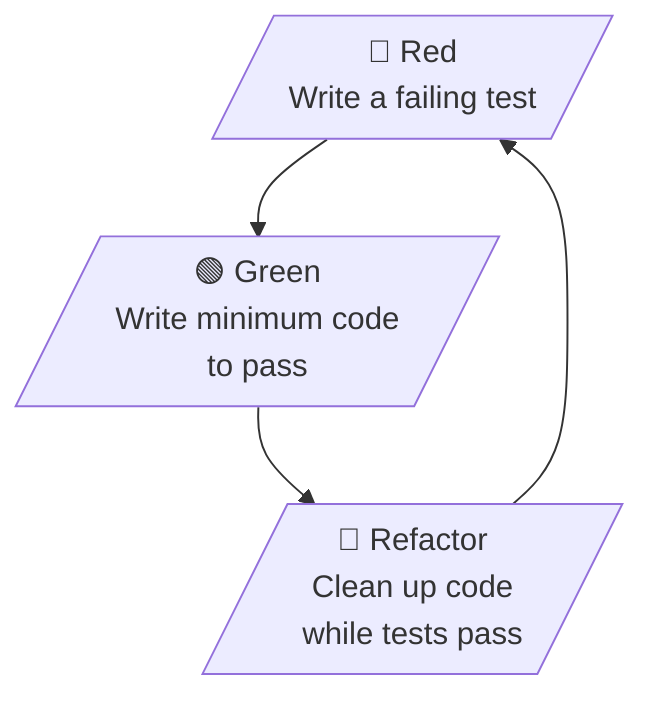

Test-Driven Development (TDD) is a software development process where you write automated tests *before* writing the production code. It's a core [[Extreme Programming|XP]] practice that changes the way you think about code design.

## The TDD Cycle: Red → Green → Refactor



### Step 1: Red (Write a failing test)
- Write a test for the next bit of functionality you want to add
- Run the test — it should fail (because the functionality doesn't exist yet)
- This failure is your "red" — it confirms the test is testing the right thing

### Step 2: Green (Write the minimum code to pass)
- Write the simplest possible code that makes the test pass
- Don't worry about code quality yet — just make it work
- The goal is to see green as quickly as possible

### Step 3: Refactor (Clean up)
- Now that you have working code and a safety net of tests, clean up
- Remove duplication
- Improve naming
- Extract methods
- Apply design patterns
- All while keeping tests green

## Example: TDD in action

Let's say we're building a string calculator:

```python
# Step 1: Red — Write a failing test
def test_empty_string_returns_zero():
    assert add("") == 0

# Run: FAIL (add function doesn't exist yet)

# Step 2: Green — Write minimum code
def add(numbers):
    return 0

# Run: PASS

# Step 3: Refactor — (nothing to refactor yet, move on)

# Step 1: Red — Write next failing test
def test_single_number_returns_itself():
    assert add("1") == 1

# Run: FAIL

# Step 2: Green — Update code
def add(numbers):
    if not numbers:
        return 0
    return int(numbers)

# Run: PASS

# Continue the cycle...
```

## Benefits of TDD

### Better design
- **Forces you to think about the interface first** — before implementation
- **Leads to loosely coupled code** — easier to test = easier to maintain
- **Prevents over-engineering** — you only write code for tested requirements
- **Small, focused functions** — each test drives one piece of behavior

### Safety net
- **Fearless refactoring** — tests catch regressions immediately
- **Confidence to change code** — knowing you'll know if something breaks
- **Documentation** — tests show how the code is supposed to work

### Faster development (longer term)
- **Less debugging** — bugs are caught immediately, not weeks later
- **Less time writing tests later** — tests are written alongside code
- **Fewer defects in production** — comprehensive test coverage

### Living documentation
- **Tests show intent** — what the code should do, not just what it does
- **New developers** can understand behavior by reading tests
- **Examples** of how to use the code

## TDD Best Practices

1. **Write small tests** — One assertion per test (or closely related assertions)
2. **Commit frequently** — Every green is a checkpoint you can return to
3. **Don't skip the refactor step** — This is where design improvement happens
4. **Name tests descriptively** — Test names should describe behavior
5. **Test behavior, not implementation** — Don't test private methods
6. **Keep tests fast** — Slow tests won't be run frequently
7. **One thing per test** — Each test should verify one behavior
8. **Don't test everything the same way** — Use different test types appropriately

## Test Types in TDD

### Unit Tests
- Test individual functions or methods
- Fast, isolated, no external dependencies
- Should make up the majority of your tests

### Integration Tests
- Test how components work together
- May involve databases, APIs, file systems
- Slower than unit tests, but verify integration

### Acceptance Tests
- Test complete user scenarios
- Verify the system works from the user's perspective
- Often written in collaboration with the customer

## TDD vs Traditional Testing

| Aspect | TDD | Traditional |
|--------|-----|-------------|
| **When tests are written** | Before code | After code |
| **Purpose** | Design tool | Verification tool |
| **Test coverage** | Naturally high | Often low |
| **Refactoring** | Safe and frequent | Risky and rare |
| **Documentation** | Tests ARE documentation | Separate documentation |
| **Bugs found** | Immediately | Weeks/months later |

## Common TDD Anti-Patterns

1. **Writing tests after code** — This is just "test-first" not TDD
2. **Testing implementation details** — Tests should verify behavior, not internal structure
3. **Skipping the refactor step** — Leads to messy, duplicated code
4. **Writing too many tests at once** — One test, one behavior, one cycle
5. **Making tests pass by changing tests** — If a test fails, fix the code, not the test
6. **Writing trivial tests** — Don't test getters/setters or simple pass-throughs

## Getting started with TDD

1. **Start small** — Pick a simple function to practice on
2. **Use a testing framework** — Jest, pytest, JUnit, etc.
3. **Commit to the process** — Red, Green, Refactor — every time
4. **Don't worry about coverage initially** — Focus on the discipline
5. **Pair with someone experienced** — TDD is easier to learn with a guide
6. **Read "Test Driven Development: By Example"** by Kent Beck

## TDD and [[Pair Programming]]

TDD pairs exceptionally well with [[Pair Programming|pair programming]]:
- The navigator can write tests while the driver writes code
- Two minds catch more edge cases
- Real-time discussion improves test quality
- Ping-pong pairing makes TDD a collaborative game
