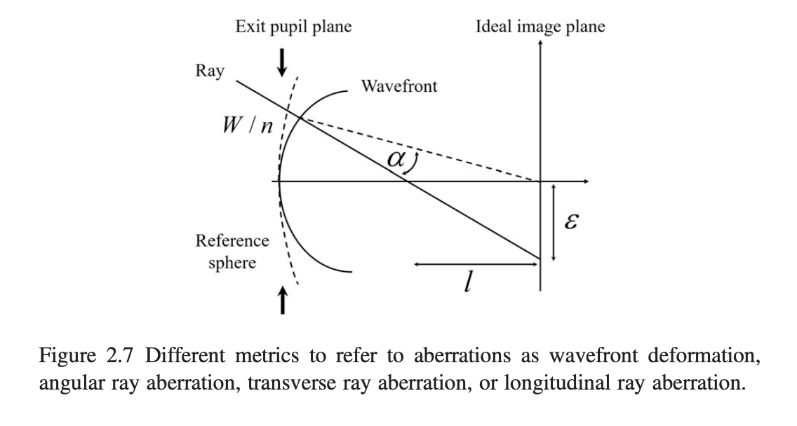

# Chapter 2 Clasical / First-order Imaging and Imaging Aberrations

## 2.1 Classical imaging

> For an object at infinity that subtends a semi-field view, $\theta$, the image height, $\bar{y}_i$, mesasured from optical axis, isrelated to the focal length $f$, by the mapping $\bar{y}_i = f \cdot \tan\theta$.
>
> However, according to the application, there are other possible mapping such as
> - the equidistant mapping $\bar{y}_i = f \cdot \theta$, or
> - the orthographic mapping $\bar{y}_id = f \cdot \sin\theta$.

In this case, for a full frame lens with focal length $f$, it's field view angle would be (in $rad$):

$$
\begin{aligned}
\theta_{vertical} &= \arctan(12/f) * 2  \\
\theta_{horizontal} &= \arctan(18/f) * 2 \\
\theta_{diagonal} &= \arctan(21.6/f) * 2 \\
\end{aligned}
$$

* $12$ and $18$ are halfs of both vertical and horizontal length of full frame sensor ($36mm\times24mm$).
* Diagnoally, half length should be $\frac{12}{sin(arctan(2/3))} \approx 21.6$

##### Table 2.1 Imaging Equations

| Newtownian Equation           | Gaussian Equation                 |
|--|--|
| $\frac{z}{f} = -\frac{1}{m}$  | $\frac{f'}{z'} + \frac{f}{z} = 1$ |
| $\frac{z'}{f'} = -m$          | $\frac{z}{f} = 1-\frac{1}{m}$     |
| $zz'=ff'$                     | $\frac{z'}{f'} = 1-m$     |
| (see comment 1)               | (see comment 2)           |

**Comments**

1. The object and image distance $z$ and $z'$ are measured, respectively, from the front and rear *focal* points. $f$ and $f'$ are the front and rear focal length.
2. The object and image distance $z$ and $z'$ are measured, respectively, from the front and rear *principal* points. The transverse magnification is $m$.

## 2.2 First-order optics

First-order imaging: first-order approximation to the path of a real ray.

**Snell's law 斯涅尔定律**

or *law of refraction* 折射定律

$$
n_1 \sin\theta_1 = n_2 * \sin\theta_2 \\
\iff

\frac{\sin\theta_1}{\sin\theta_2} = n_{21} = \frac{n_2}{n_1} = \frac{v_1}{v_2}
$$

where
- $\theta_1$ ($I$ in the book) angle of incidence 入射角 
- $\theta_2$ ($I'$ in the book) angle of refraction 折射角 
- $n_1$, $n_2$ ($n$, $n'$ in teh book) refraction indicies 折射率
- $v_1$, $v_2$ phase velocities 相速度

**Paraxial approximation 近轴假设** 

A paraxial ray is a ray that makes a small angle ($\theta$) to the optical axis of the system, and lies close to the axis throughout the system. Generally, this allows three important approximations (for θ in radians) for calculation of the ray's path, namely:

$$
\sin\theta \approx \theta \\
\tan\theta \approx \theta \\
\cos\theta \approx 1
$$

The paraxial approximation is used in Gaussian optics and first-order ray tracing.

**Apply first-order approximation to Snell's law**

$$
n'i' = n i \\
$$

Treat the optical surface as planar but with refacting power $\phi$.

To trace a first-order ray, the refraction and transfer equation are used:

$$
n'u' = n u - y\phi \\
y' = y + u't
$$

where
- $u$, $u'$ are slopes (斜率) of the ray before and after the refraction,
- $y$ is the ray height at the surface which is assumed plannar but with optical power $\phi$,
- $n$ is the index of refraction,
- $t$ is the distance to the next surface.

### Concepts

- **Optial axis**: The axis about which  an optical system has rotational symmetry
- **Object space**
- **Image space**
- **Aperture stop**: The aperture that solely limits the amount of light for the axial light beam.
- $f$ and $f'$: front and rear focal length.
- **Optical power**/ **Refractive power** ($\phi$): $\phi = -\frac{n}{f} = \frac{n'}{f'}$; $n$ is the index of refraction in object.
- **Effective focal length (EFL)**, **F/#**, **F number**: The effective focal length divided by the diameter of the entrance puupil. $F/\# = \frac{EFL}{2y_e}$
- **Lagrange invarant** ($Ж$): It relaets to the optical throughtput or capacity of an optical to transfer optical power. $Ж=n\bar{u}y - nu\bar{y}$
- **Afocal**: The focal lengths are not defined.
- **Transverse magnification** ($m$): The first-order ratio of the image size to the object size.

### Quantities

of marginal and chief first-order rays'.

| Item | Marginal ray | Chief ray |
|-|-|-|
| Object/pupil distance     | $s$ | $\bar{s}$ |
| Image/pupil distance      | $s'$ | $\bar{s'}$ |
| Ray slope of incidence    | $i = u - a$ | $\bar{i} = \bar{u} - \bar{a}$ |
| Ray height at surface     | $y\\y_e\\y_s$ | $\bar{y}\\\bar{y}_o\\\bar{y}_i$|
| Ray slope                 | $u = -y/s$ | $\bar{u} = -\bar{y}/\bar{s}$ |
| Normal line slope         | $\alpha = -y/r = u - i$ | $\bar{\alpha} = -\bar{y}/r = \bar{u} - \bar{i}$ |
| Refraction invariant      | $A = ni = n(\frac{1}{r} - \frac{1}{s})y$  | $\bar{A} = n\bar{i} = n(\frac{1}{r} - \frac{1}{\bar{s}})\bar{y}$ |
| Surface radius            | $r$ | |
| Surface vertex curvature  | $c$ | |
| Thickness to next surface | $t$ | |
| Surface optical power     | $\phi = \frac{n'-n}{r}$ | |
| Lagrange invariant        | $Ж=n\bar{u}y - nu\bar{y} = \bar{A}y - A\bar{y}$ | |

Two points are required to define a ray; the first point is defined by the field vector, $\vec{H}$, which lies in the object plane, and the second point is defined by the aperture vector, $\vec{\rho}$, which lies in the exit pupil plane. Both vectors are normalized so their magnitudes range from 0 to 1.

## 2.3 Image Aberrations

$$
OPL = \int_a^bn(s)ds \\
OPL = \sum_i{n_i s_i}
$$

> In a homogenous medium the wavefront is spherical in shape. However, when the wavefront propagates through an optical system, it is deformed, and its shape is no longer spherical. As the rays are normal to the wavefront, they no longer converge to a sharp image point; i.e., the ideal image point as defined by central projection.

- $W/n$ wave deformation.
- $\alpha$ angular ray aberration
- $\epsilon$ transverse ray aberration 
- $l$ longitudinal ray aberration.

> For an axially symmetric system the aberration function, $W(\vec{H},\vec{\rho})$ , provides the geometrical wavefront deformation at the exit pupil as a function of the normalized field, $\vec{H}$, and aperture, $\vec{\rho}$, vectors.
>
> The field vector is located at the object plane and defines where a given ray originates from. The aperture
vector defines the intersection of a given ray with the pupil plane. The
aperture vector is usually located at the exit pupil plane, but it can also be
located at the entrance pupil plane.
>
> The
aberration function, being a scalar, involves dot products of the field and aperture vectors, specifically $\vec{H} \cdot \vec{H}$, $\vec{H} \cdot \vec{\rho}$, and $\vec{\rho} \cdot \vec{\rho}$. These dot products only depend on the magnitude of the vectors and on the cosine of the angle, $\phi$, between them.
>
> Equivalently, the aberration function provides the Optical Path Difference (OPD) between the OPL from the object to the wavefront at the exit pupil, and the OPL from the object point to the reference sphere. The aberration function is written to sixth-order of approximation as:

$$
W(\vec{H}, \vec{\rho}) = \sum_{j, m, n} W_{k,l,m} (\vec{H} \cdot \vec{H})^j (\vec{H} \cdot \vec{\rho})^m (\vec{\rho} \cdot \vec{\rho}) ^ n \\
where \\
k = 2j + m \\
l = 2n + m
$$

> The order of an aberration term is given by $2 \cdot (j + m + n)$, which is always an even order.
> 
> The lower indices $k, l, m$ in each coefficient indicate, respectively, the algebraic power of the field vector, the aperture vector, and the cosine of the angle $\phi$ between these vectors.

> The fourth-order terms are often called the primary aberrations. The ten sixth-order terms can be divided into two groups. The first group (first six terms) can be considered as an improvement upon the primary aberrations by their increased field dependence, and the second group (last four terms) represents new wavefront deformation forms.

- Forth order
  - Spherical aberration $W_{040}$
  - Coma $W_{131}$
  - Astigmatism $W_{222}$
  - Field curvature $W_{220}$
  - Distortion $W_{311}$
- Sixth order
  - Oblique spherical aberration $W_{240}$
  - Coma $W_{331}$
  - Astigmatism $W_{422}$
  - Field curvature $W_{420}$
  - Distortion $W_{511}$
  - Spherical aberration 
    - $W_{060}$
    - $W_{151}$
    - $W_{242}$
    - $W_{333}$

## 2.4 Computing Aberration Coefficient

> For an optical system made out of j spherical surfaces, the fourth-order aberration coefficients are determined by computing the Seidel sums, $S_{I}$, $S_{II}$, $S_{III}$, $S_{IV}$ and $S_{V}$. These sums depend only on the Lagrange invariant, and on quantities from a first-order marginal and chief ray trace.

| Coefficient | Seidel sum |
|--|--|
| $W_{040}=\frac{1}{8}S_{I}$ | $S_{I} = -\sum_{i=1}^{j}(A^2y\Delta(\frac{u}{n}))_i$ |
| $W_{131}=\frac{1}{2}S_{II}$ | $S_{II} = -\sum_{i=1}^{j}(A\bar{A}y\Delta(\frac{u}{n}))_i$ |
| $W_{222}=\frac{1}{2}S_{III}$ | $S_{III} = -\sum_{i=1}^{j}(\bar{A}^2y\Delta(\frac{u}{n}))_i$ |
| $W_{220}=\frac{1}{4}(S_{III} + S_{IV})$ | $S_{IV} = -Ж^2\sum_{i=1}^{j}P_i$ |
| $W_{311}=\frac{1}{2}S_{V}$ | $S_{V} = -\sum_{i=1}^{j}(\bar{A}[\bar{A}^2\Delta(\frac{1}{n^2})y - P (Ж + \bar{A}y)\bar{y}])_i$ |

where:
- $A = ni = nu + nyc$
- $\bar{A} = n\bar{i} = n\bar{u} + n\bar{y}c$
- $Ж = n\bar{u}y - nu\bar{y} = \bar{A}y - A\bar{y}$
- $c = \frac{1}{r}$
- $P = c\cdot\Delta(\frac{1}{n})$

## 2.5 Field of View and Relative Aperture

> The relative aperture is defined as the ratio of the effective focal length EFL to the diameter of the entrance pupil $D_E$. Also known as $F/\#$, $FNO$, $F$-number, and focal ration $F$. 
>
> For lens systems that work at finite conjugates the effective relative aperture, sometimes referred to as the working $F/\#$, is given by $F/\# = (1-m)EFL/D_E$, where $m$ is the transverse magnification.

> In a lens that is free from spherical aberration the numerical aperture ($NA$) is defined by $NA = n\sin(\theta)$ where n is the index of refraction and $\theta$ is the angle of the real marginal ray with the optical axis

> Usually, the larger the field of view or the lower the $F/\#$ is, the more difficult it is to design a lens.

## 2.7 Stop Shifting

$$
\bar{S} = \frac{\bar{u}_{new}-\bar{u}_{old}}{u} = \frac{\bar{y}_{new}-\bar{y}_{old}}{y} = \frac{\bar{A}_{new}-\bar{A}_{old}}{A}
$$

where
- $\bar{A} = n\bar{i}$ is the refraction invariant for the chief ray
- $A = ni$ is the refraction invarant for the marginal ray
- $\bar{u}, \bar{y}$ are the chief ray slope and height at the surface
- $u, y$ are the marginal ray slop and the height at the surface

Then Seidel sums upon stop shifting:
$$
\begin{aligned}
&S^\ast_{I} = S_{I} \\
&S^\ast_{II} = S_{II} + \bar{S}S_{I} \\
&S^\ast_{III} = S_{III} + 2\cdot\bar{S}S_{II} + \bar{S}^2S_{I} \\
&S^\ast_{IV} = S_{IV} \\
&S^\ast_{V} = S_{V} + \bar{S}(S_{iv} + 3\cdot S_{III}) + 3 \cdot \bar{S}^2S_{II} + \bar{S}^3S_{I}
\end{aligned}
$$

## 2.8 Parity of the Aberrations and the Principle of Symmetry

> The odd aberrations are coma and distortion. When there is some lens symmetry about the stop aperture, the odd aberrations tend to cancel, and this provides a mechanism to correct or mitigate the odd aberrations. This is known as the principle of symmetry about the stop.

# Chapter 3 Aspheric Surfaces

## 3.1 Spherical surface

